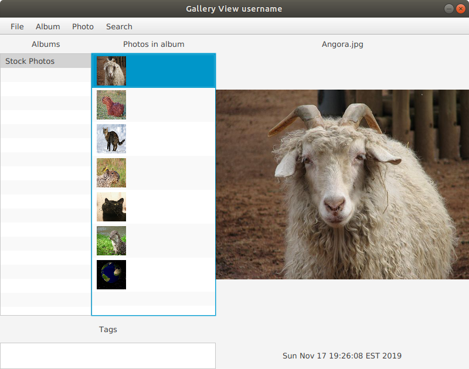
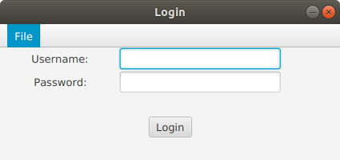
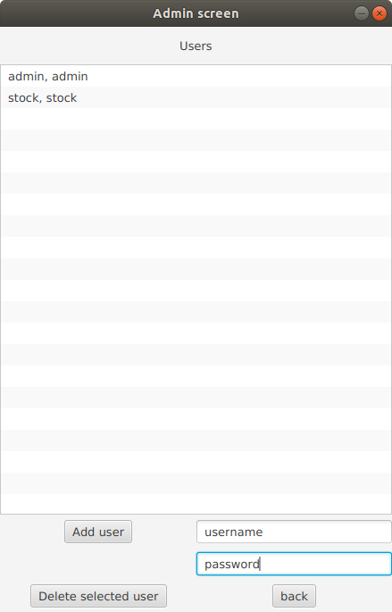

# Image Gallery

* Image Gallery written in Java using JavaFX
* Uses the Model view controller design pattern
* Uses FXML for the user interface
* Serialization is used for saving user profiles
* Supports multiple users with different folders for each user
* Javadocs created for the entire program 

User view with stock photos from Wikipedia

Login screen

Admin screen

## Directions

* Run the program with Photos.java in the photos.app package
* Login with username "admin", password "admin" (no quotes)
* Albums and Photos can be navigated by clicking on them in the ListViews.
* The dropdown menu contains all of the commands.
* Clicking on view slideshow in the menu will change the screen to slideshow mode.
